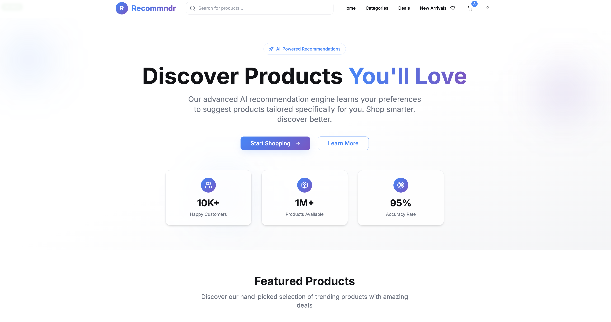
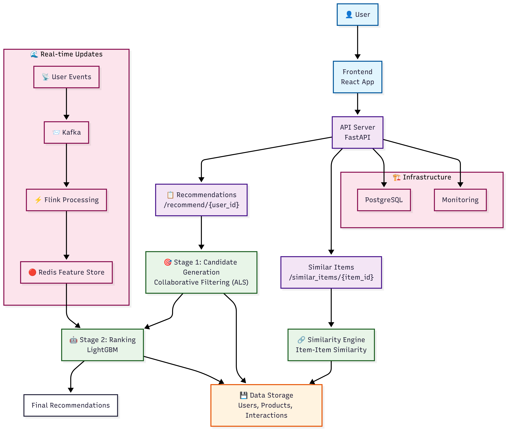

# 🛍️ Recommndr — Production-Grade E-Commerce Recommendation Pipeline

A full-stack, production-grade ML system for real-time e-commerce recommendations using a **two-stage pipeline**: ALS (Collaborative Filtering) + LightGBM (Ranking).

## 🎨 Frontend Preview




## 🏗️ Architecture



**Key Components:**
- **Two-stage ML Pipeline**: ALS candidate generation + LightGBM ranking
- **Real-time Streaming**: Kafka → Flink → Redis feature store
- **Production Ready**: FastAPI + ONNX + Docker + Azure deployment
- **Data Pipeline**: DVC versioning with Azure Blob Storage
- **Monitoring**: Prometheus + Grafana + MLflow tracking

## 🛠️ Tools Used (Short List)

### *Data & ML Pipeline*
- *Python* (main language)
- *Pandas, NumPy* (data processing)
- *Scikit-learn* (ML utilities)
- *Great Expectations* (data validation)
- *DVC* (data versioning)
- *MLflow* (experiment tracking)

### *Streaming & Real-time*
- *Kafka* (event streaming)
- *Flink* (stream processing)
- *Feast* (feature store)
- *Redis* (caching)

### *ML Models & Serving*
- *ALS* (collaborative filtering)
- *LightGBM* (ranking model)
- *ONNX* (model optimization)
- *ONNX Runtime* (fast inference)
- *Faiss* (vector similarity)

### *APIs & Web*
- *FastAPI* (Python API server)
- *Next.js* (frontend framework)
- *Swagger UI* (API documentation)

### *Cloud & Deployment*
- *Azure* (cloud platform)
- *Docker* (containerization)
- *GitHub Actions* (CI/CD)
- *Azure Container Apps* (deployment)
- *Git* (version control)

### *Testing & Development*
- *Pytest* (testing)

### *Monitoring & Security*
- *Prometheus + Grafana* (monitoring)
- *Azure Monitor* (cloud monitoring)
- *Azure Key Vault* (secrets management)
- *JWT* (authentication)

## 📁 Project Structure

```
src/
├── data_generation/    # Synthetic data generation
├── processing/         # Data processing & feature engineering
├── retrieval/          # ALS candidate generation (Phase 3)
├── ranking/           # LightGBM ranking (Phase 4)
├── similarity/        # Item similarity engine (Phase 5)
├── serving/           # FastAPI serving layer (Phase 6)
├── streaming/         # Kafka + Flink real-time processing
└── validation/        # Data validation with Great Expectations

models/                # Trained ML models (ALS, LightGBM, ONNX)
data/                  # DVC-tracked data (users, products, interactions)
frontend/              # React application
docker/                # Docker configuration
```

## 🚀 Quick Start

### Prerequisites
- Python 3.9+, Docker, Git

### Setup
```bash
# Clone and setup
git clone <your-repo-url>
cd recommndr
python -m venv venv && source venv/bin/activate
pip install -r requirements.txt

# Run data pipeline
dvc repro

# Start services
docker-compose up -d

# Test API
python test_phase6_api.py
```

## 📊 System Phases

- **Phase 1**: Data Generation & Validation (10K users, 1K products, 100K interactions)
- **Phase 2**: Streaming Pipeline (Kafka + Flink + Redis)
- **Phase 3**: ALS Candidate Generation (Collaborative Filtering)
- **Phase 4**: LightGBM Ranking (27+ contextual features)
- **Phase 5**: Similarity Engine (Item-item recommendations)
- **Phase 6**: FastAPI Serving Layer (Production endpoints)
- **Phase 7**: Frontend Development (React application)

## 🔧 Development

### Key Commands
```bash
# Data pipeline
dvc repro                    # Run complete pipeline
dvc push                     # Push to Azure storage

# ML pipeline
python -m src.ranking.main --train    # Train LightGBM model
python demo_complete_lifecycle.py     # End-to-end demo

# API testing
python test_phase6_api.py             # Test all endpoints
```

### Performance
- **End-to-End Latency**: <200ms
- **Data Quality**: 88.75% validation score
- **Real-time Updates**: 5-15 seconds from event to recommendation

## 🚀 Deployment

### Azure Services
- **Container Apps**: API deployment 
- **Static Web Apps**: Frontend hosting 
- **Blob Storage**: DVC data versioning 
- **Redis Cache**: Feature store

### Deploy to Production
```bash
# Deploy to Azure
az containerapp up --name recommndr-api --resource-group recommndr-rg
```

## 📝 License

MIT License - see LICENSE file for details.

## 🤝 Contributing

1. Fork the repository
2. Create a feature branch
3. Make your changes
4. Add tests
5. Submit a pull request

---
